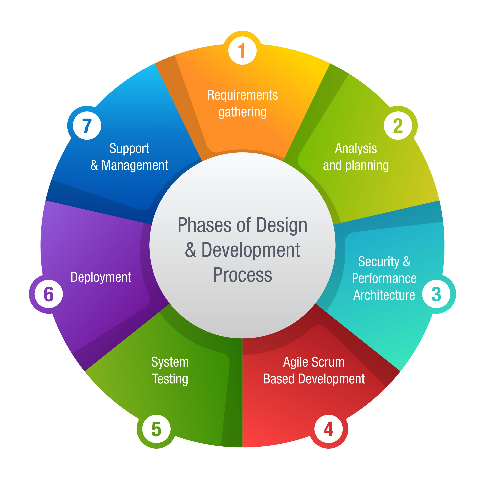

# what is SDLC list out 7 phases of SDLC ?
1. SDLC is a structured process used by the software industry to design, develop, and test high-quality software i.e called SDLC
2. The 7-phase model separates initial project planning from the technical requirements gathering i.e called 7-phase SDLC
3. SDLC consists of 7 main phases ...

**phases of SDLC**
1. Planning
2. Requirement Analysis
3. Design
4. Development (Coding)
5. Testing
6. Deployment
7. Maintenance

# Planning ...

1. Phase where the team defines the project scope, estimates costs, allocates resources, and identifies potential risks i.e called planning

    **examples**

    ```
    Creating a project schedule and budget estimation
    ```

# Requirement Analysis ...

1. Phase where the team gathers detailed functional and technical requirements from the client to understand what needs to be built i.e called requirement analysis

    **examples**

    ```
    Documenting the exact features and user roles the application must have
    ```

# Design ...

1. Phase where the system architecture, user interface, and database structures are planned out based on the requirements i.e called design

    **examples**

    ```
    Creating UI wireframes and database schemas
    ```

# Development (Coding) ...

1. Phase where developers actually write the source code to build the software according to the design documents i.e called development

    **examples**

    ```
    Writing application logic using programming languages 
    ```

# Testing ...

1. Phase where the software is checked for bugs, errors, and security flaws to ensure it works exactly as expected i.e called testing

    **examples**

    ```
    Running unit tests and user acceptance testing
    ```

# Deployment ...

1. Phase where the finished software is officially released to the users or installed on the production environment i.e called deployment

    **examples**

    ```
    Uploading a web application to a live server
    ```

# Maintenance ...

1. Phase where the software is updated, bugs are fixed after release, and new features are added over time i.e called maintenance

    **examples**

    ```
    Releasing security patches or version updates
    ```


# SDLC life cycle diagram ...

  